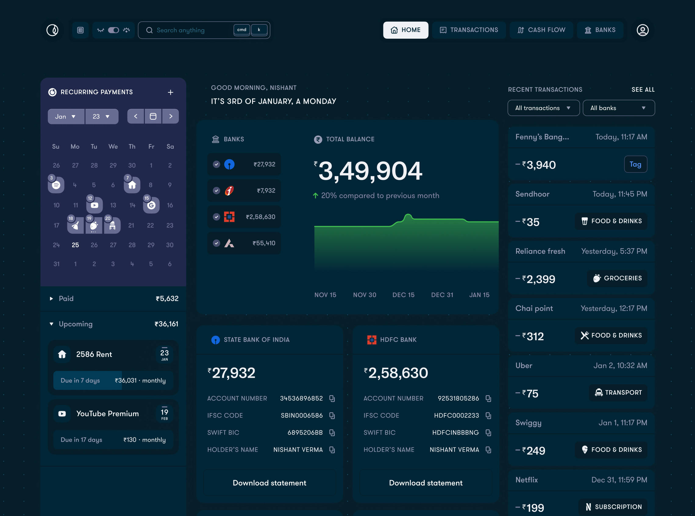
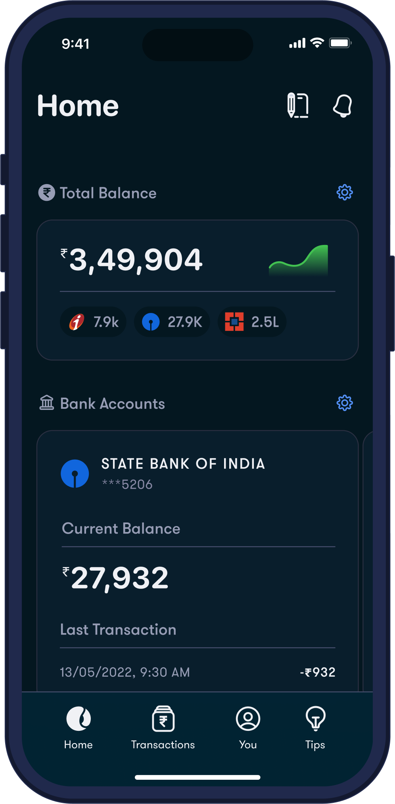

# Nyx Landing Page (Assessment)

Fold-inspired personal finance landing page built for the Nyx assessment.

## Tech Stack

- React 19 + TypeScript
- Vite 8
- Tailwind CSS v4
- GSAP (ScrollTrigger, Draggable)
- ESLint

## Features

- Hero section with custom typography and motion
- Swipe-to-pay interaction card
- Click-to-expand dashboard preview
- Post-hero intro section with interactive graffiti peel sticker
- Bento-style ending section using provided image assets
- Responsive layout tuned for desktop + mobile

## Project Structure

- `src/pages/LandingPage.tsx` - page composition and reveal animations
- `src/components/FoldHero.tsx` - hero content + motion
- `src/components/SwipeToPaySection.tsx` - swipe interaction + dashboard modal
- `src/components/PostHeroIntro.tsx` - left-aligned copy + sticker peel
- `src/components/NyxBentoEnding.tsx` - bento footer/ending
- `src/index.css` - tokens, layout system, and component styling

## Run Locally

```bash
npm install
npm run dev
```

Open `http://localhost:5173`.

## Available Scripts

- `npm run dev` - start development server
- `npm run build` - type-check + production build
- `npm run lint` - run lint checks
- `npm run preview` - preview production build locally

## Screenshots

### Landing View



### Alternative Landing View



## Build Status

The project is set up to pass:

- `npm run build`
- `npm run lint`

## Notes

- Image assets used in UI are stored in `src/assets/nyx`.
- README screenshots must use paths inside this repository to render on GitHub.
